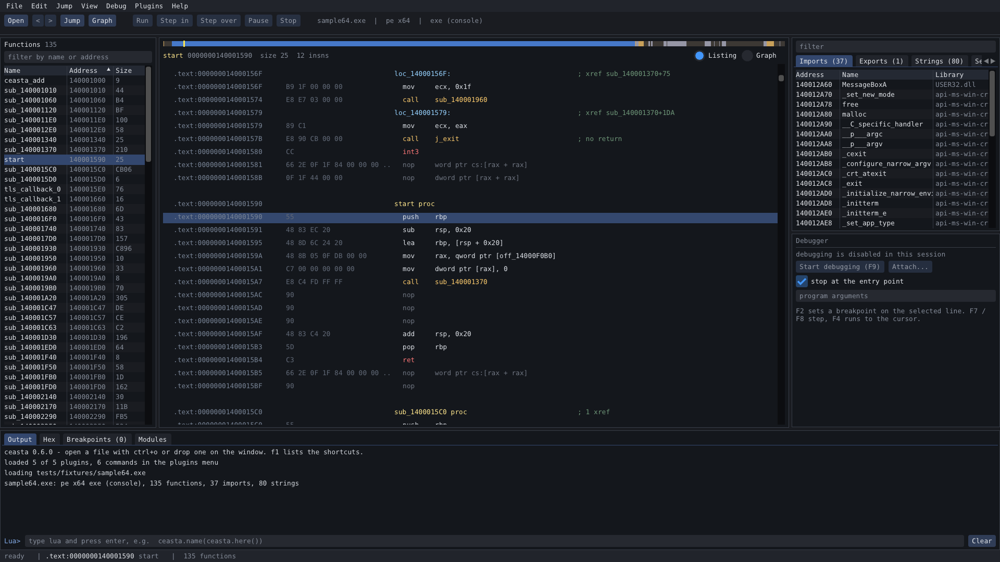
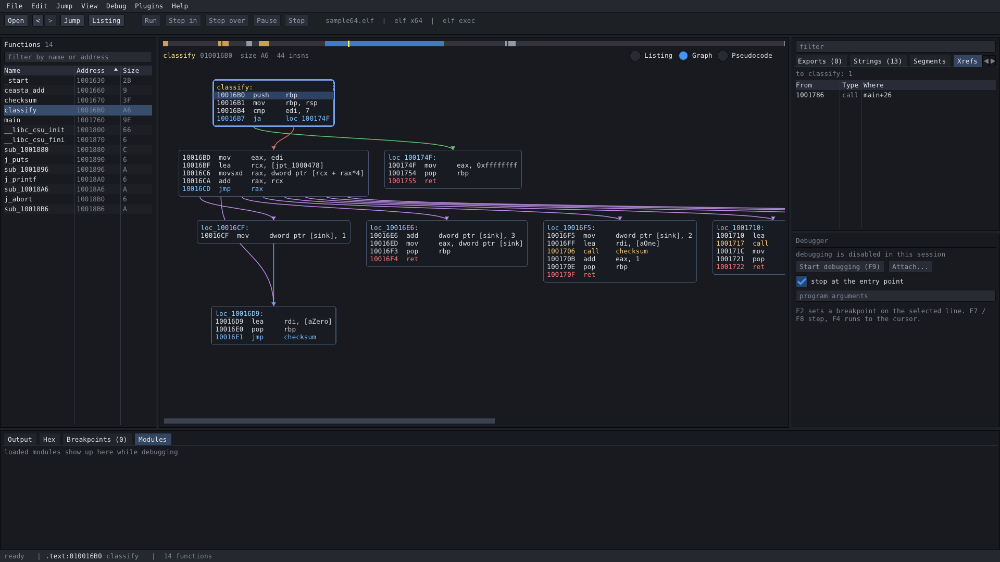
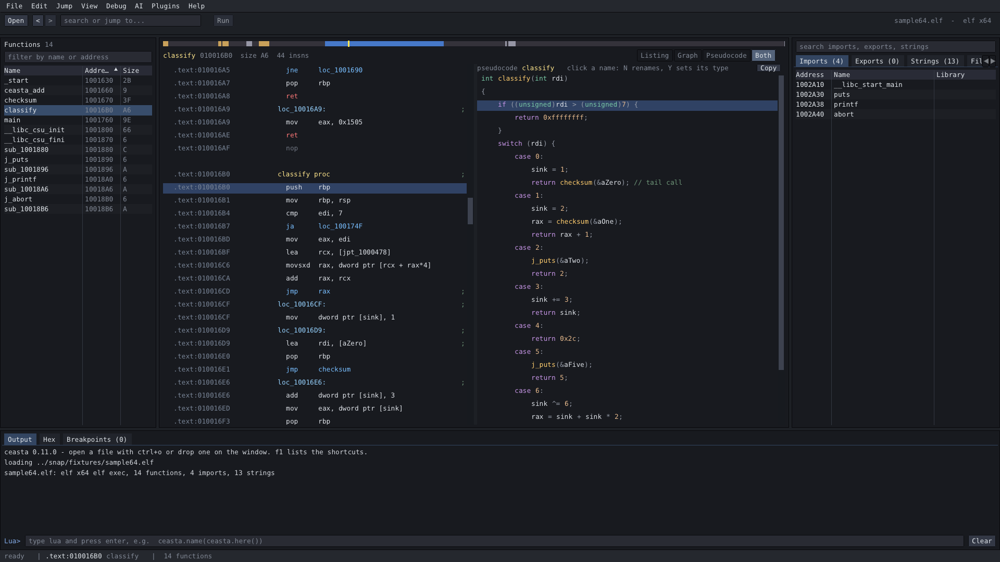

<p align="center">
  
</p>
<h1 align="center">ceasta</h1>
<p align="center">a disassembler, decompiler and debugger in one — for windows and linux</p>
<p align="center">
  <a href="https://github.com/ngwg/ceasta/releases"></a>
  
  <a href="LICENSE"></a>
  
</p>

ida-style listing, a decompiler, a function graph, an x64dbg-style debugger, and lua plugins — one small program, everything vendored, nothing to install to build.



## one function, three ways

ceasta shows the same code from raw bytes up to readable c, so you can drop to whatever level you need:

```text
; assembly — the real instructions, with names            ; pseudocode (F5) — reconstructed c
checksum proc                                             int checksum(int rdi)
  movzx  ecx, byte ptr [rdi]                              {
  test   cl, cl                                               if (*(char*)rdi == 0) {
  je     loc_10016A9                                             return 0x1505;
  ...                                                          }
  mov    edx, eax                                             do {
  shl    edx, 5                                                   rax = rcx + ((rax << 5) + rax);
  add    edx, eax                                             } while (*(char*)rdi != 0);
  ...                                                          return rax;
                                                           }
```

the decompiler is best-effort — great for reading a routine quickly, but the listing stays the source of truth.

## download

grab it from the [releases page](https://github.com/ngwg/ceasta/releases):

| file | platform | what you get |
|------|----------|--------------|
| `ceasta-x.y.z-setup.exe` | windows 10/11 x64 | the full app, installs for your user (no admin), start menu + optional "open with ceasta" |
| `ceasta-x.y.z-windows-x64.zip` | windows x64 | the full app, portable — unzip and run `ceasta.exe` |
| `ceasta-cli-x.y.z-linux-x64.tar.gz` | linux x64 | `ceasta-cli` + plugins: analysis, disassembly, decompiler, scripting, terminal debugger ([on linux](#on-linux)) |

## what it does

- opens pe files (exe, dll, sys — 32 and 64 bit), elf (x86 / x64) and raw shellcode
- auto analysis: functions (entry, exports, symbols, .pdata, tls callbacks, calls, pointers in data), switch tables, xrefs, strings (ascii + utf-16), imports / exports, thunks, noreturn calls
- ida-style listing: names instead of addresses, labels, xref and string comments
- function graph (space): colored edges, zoom with ctrl + wheel, drag to pan
- decompiler (f5): c-like pseudocode for a function — if / else, while / do, switch, calls with names
- debugger: start or attach, breakpoints, step into / over, run to cursor, pause, registers, stack, live memory
  - **windows**: full gui debugger + terminal, win32 debug api, 32-bit via wow64
  - **linux**: a terminal debugger on ptrace (`ceasta-cli dbg`) — breakpoints, stepping, registers, memory. basic but real; best on single-threaded targets
- rename, comments, jump to address or name, xrefs, byte search, back / forward
- names, comments and breakpoints are saved per file
- lua plugins and a lua console; `ceasta-cli` for scripts and ci

## layout

one window, nothing floating around:

- top: menu and toolbar
- left: functions
- middle: overview band, then the listing, the graph, or the pseudocode
- right: imports / exports / strings / segments / xrefs, with the debugger (registers + stack) under it
- bottom: output + lua console, hex, breakpoints, modules
- drag the lines between panels to resize, the view menu hides panels and switches theme, ctrl + / ctrl - changes the text size



the decompiler (f5):



## keys

| key | what | key | what |
|-----|------|-----|------|
| ctrl+o | open a file | space | listing / graph |
| g | jump to address or name | f5 | pseudocode (decompiler) |
| enter / double click | follow the operand | alt+b | search bytes |
| esc / ctrl+enter | back / forward | f9 | start debugging / continue |
| n | rename | f7 / f8 | step into / over |
| ; | comment | f4 | run to cursor |
| x | references to here | f2 | toggle breakpoint |
| ctrl+s | save names and comments | f1 | all shortcuts |

## plugins

plugins are lua files in `plugins/` (next to the program) or in `%APPDATA%\ceasta\plugins`. they add commands to the plugins menu. five come with it: file summary, crypto finder, wrapper namer, strings report, call tracer (debugger).

```lua
ceasta.register_command("Count calls", function()
    local n = 0
    for _, fn in ipairs(ceasta.functions()) do
        n = n + #ceasta.xrefs_to(fn.addr)
    end
    ceasta.log(n .. " references to functions")
end)
```

the whole api is in the [lua scripting guide](docs/lua.md). the output panel has a lua prompt too — try `ceasta.name(ceasta.here())`.

## cli

```
ceasta-cli info file.exe            format, entry, segments
ceasta-cli funcs file.exe           functions
ceasta-cli disasm file.exe main 40  listing from a name or address
ceasta-cli graph file.exe start     basic blocks of a function
ceasta-cli decompile file.exe main  pseudocode for a function
ceasta-cli xrefs file.exe CreateFileW
ceasta-cli find file.exe "48 8b ?? 05"
ceasta-cli run file.exe script.lua  run a plugin / script
ceasta-cli dbg ./program [args]     interactive debugger (linux + windows)
```

## on linux

the gui is windows-only, but the command line tool does the analysis, disassembly, decompiler, scripting and a terminal debugger. grab `ceasta-cli-x.y.z-linux-x64.tar.gz`, unpack and run — nothing else to install:

```
tar xzf ceasta-cli-*-linux-x64.tar.gz
cd ceasta-cli-*-linux-x64

./ceasta-cli info /bin/ls                   format, entry, function / import / string counts
./ceasta-cli decompile /bin/ls start        pseudocode for the entry point
./ceasta-cli run /bin/ls plugins/hello.lua  run a lua plugin
./ceasta-cli dbg ./program                  debug it (break, step, registers, memory)
```

it reads elf (x86 / x64) and windows pe files alike, so you can look at a windows exe from linux too.

the terminal debugger (`dbg`) is a ptrace debugger with ceasta's names, disassembly and decompiler built in:

```
(ceasta) b main            break at a name or address
(ceasta) c                 continue
(ceasta) ni / si           step over / into      until <addr>  run to
(ceasta) r                 registers             k  stack       x <addr>  memory
(ceasta) u                 disassemble here (with names)
(ceasta) dec               decompile the function you're stopped in
(ceasta) lua ...           run lua against the live process
```

## build

everything needed is in the repo — just a compiler, nothing to fetch.

**windows**
- visual studio 2022: open `ceasta.sln`, pick `Release | x64`, build → `build\msvc\Release`
- or cmake: `cmake -S . -B build` then `cmake --build build --config Release`
- release files (zip + installer, needs [inno setup 6](https://jrsoftware.org/isinfo.php)): `powershell -ExecutionPolicy Bypass -File installer\package.ps1`

**linux** (core + cli, the gui is windows-only)
```
cmake -S . -B build && cmake --build build -j
```

## code

- `src/app.*` — state, actions and the main layout
- `src/ui/` — one file per panel (top_bar, left_panel, ida_view, graph_view, pseudo_view, right_panel, cpu_panel, bottom_panel, status_bar, dialogs)
- `src/widgets/` — small shared bits (nav_band, splitter)
- `src/core/` — no ui: loaders (`binary`, `pe`, `elf`), `disasm` (capstone), `analysis`, `database`, `decompiler`, `lua_host`, `debugger` (win32) + `debugger_linux` (ptrace), `os`
- `src/cli/` — ceasta-cli and the `dbg` terminal debugger
- `plugins/` — lua plugins that ship with it
- `docs/` — the [lua guide](docs/lua.md), the [changelog](docs/CHANGELOG.md), third-party licenses, screenshots
- `installer/` — inno setup script and packaging
- `third_party/` — imgui, capstone (x86 only), lua 5.4

## license

ceasta is [GPLv3](LICENSE). the vendored libraries keep their own (permissive) licenses — dear imgui and lua are MIT, capstone is BSD; details in [docs/THIRD_PARTY_NOTICES.md](docs/THIRD_PARTY_NOTICES.md).
